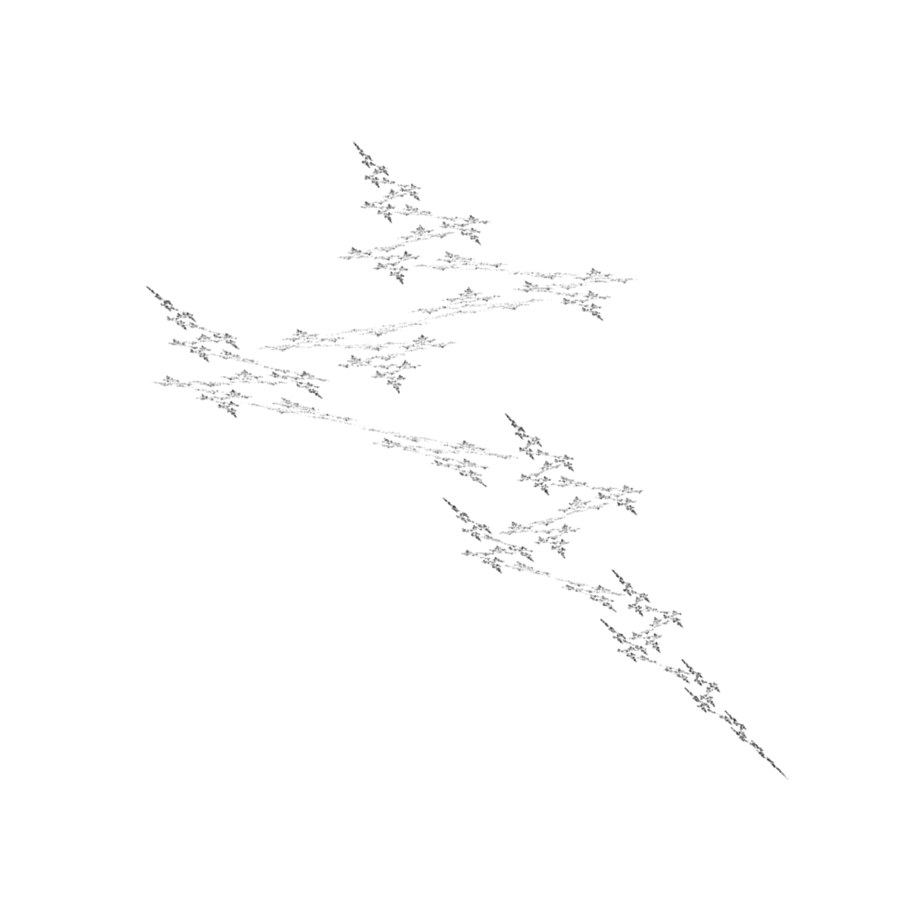
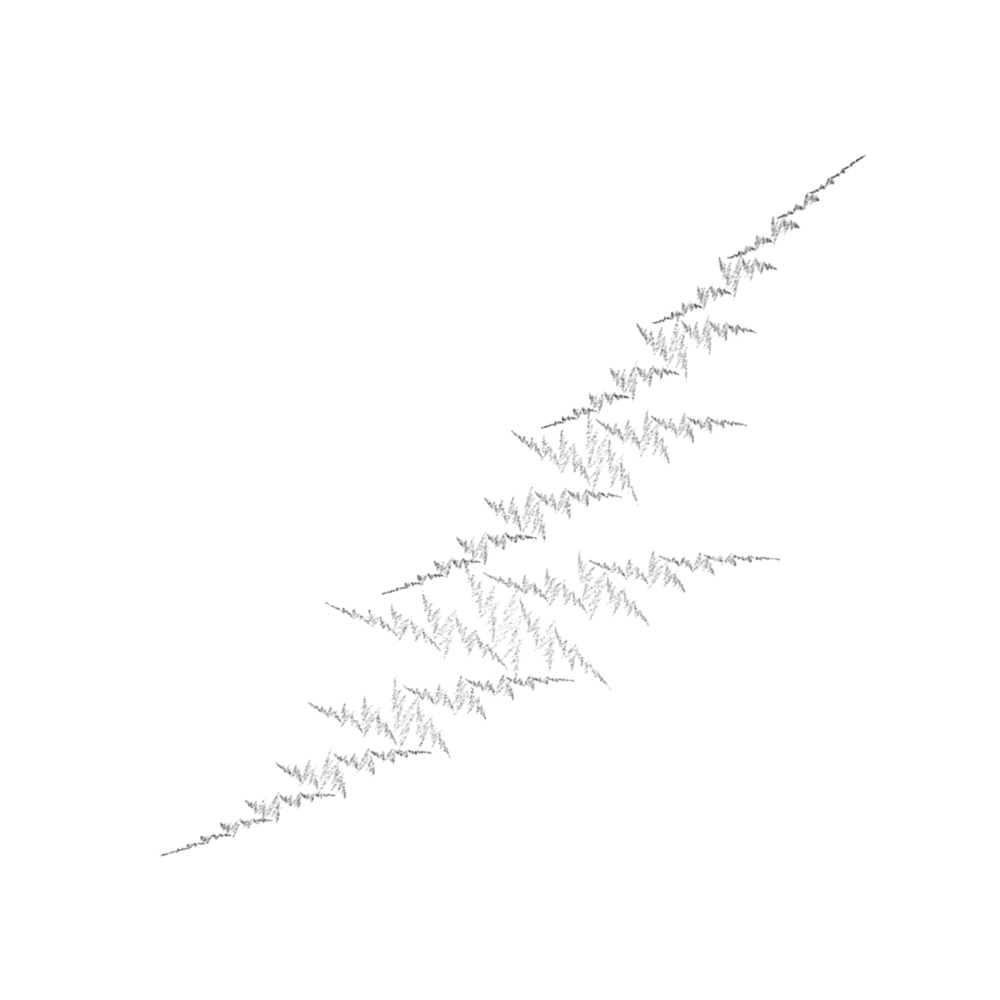
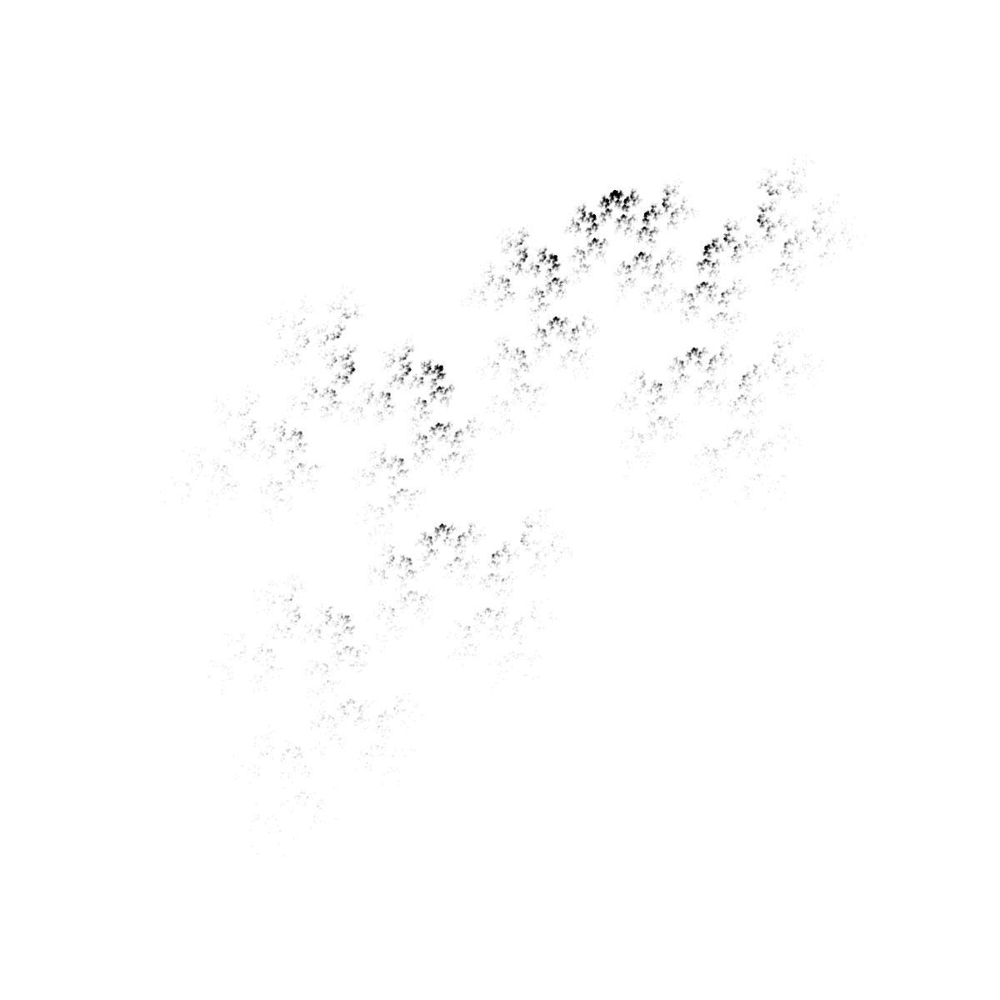

# Introducción 

Los sistemas de funciones iteradas, SFI, son construcciones matemáticas que permiten representar conjuntos de puntos que presentan autosimilaridad, autoafinidad o autocorrelación. En este caso estamos interesados en SFI que apliquen trasformaciones afijas, así estas SFI tomaran la forma:
\begin{gather}
f_{1}(x,y)=
\begin{bmatrix}
c_{1} & c_{2} \\
c_{3}& c_{4} 
\end{bmatrix}
\begin{bmatrix}
x \\
y 
\end{bmatrix}
+
\begin{bmatrix}
c_{5} \\
c_{6}
\end{bmatrix}\\
f_{2}(x,y)=
\begin{bmatrix}
c_{7} & c_{8} \\
c_{9}& c_{10} 
\end{bmatrix}
\begin{bmatrix}
x \\
y 
\end{bmatrix}
+
\begin{bmatrix}
c_{11} \\
c_{12}
\end{bmatrix}
\end{gather}

de forma más específica se ha representado un SFI con dos atractores. Para la representación de el atractor codificado en este SFI se hace uso del algoritmo de iteración aleatoria. Primero se escoge un punto aleatorio del espacio métrico, en este caso de dos dimensiones, seleccionado el punto se escoge una de las funciones que pertenecen al SFI de forma aleatoria, se aplica esta función al punto inicial. Este mismo procedimiento se repetira sobre el resultado de la primera iteración. Las coordenadas de los puntos en las distintas iteraciones se representan en el espacio métrico obteniendose la representación del atractor codificado en el SFI. 

En este trabajo se hace uso del algoritmo propuesto en (1) para la obtención de motivos visualmente relevantes. Así se generan los coeficientes del SFI de forma aleatoria, se obtiene la representación por el metodo de iteración aleatoria mientras se va evaluando la calidad visual de estos mediante dos coeficientes, la dimension fractal y el exponente máximo de Lyapunov. Siguiendo con las conclusiones obtenidas en (1) aquellos atractores visualmente relevantes serán los que posean una dimensión fractal mayor que 1 y un exponente máximo de Lyapunov menor que -0.2. Si cumple estos requisitos la representación se cosiderará visualmente relevante, exito, en caso contrario no se considera relevante, fracaso. Las Figuras 1, 2 y 3 muestran tres SFI visualmente relevantes. 

{width=500 height=500}  

{width=500 height=500}  

{width=500 height=500}  


En este trabajo se quiere hacer inferencia sobre la proporción de representaciones visualmente relevantes sobre el total de las generadas. Esta inferencias se realizará para SFI con 2, 3 y 4 atractores, con el objetivo de comprar las proporciones en función del número de atractores de sus SFI. Los datos han sido generados en Python 3.8.

# Inferencia Bayesiana sobre la proporción de representaciones visualmente relevantes

## Lectura de los datos

Primero se procede a cargar los datos en R:

```{r}
data <- read.csv("datos_investigacion.csv")

```

y se separan los datos para 2, 3 y 4 atractores en distintas variables:

```{r}
head(data)
str(data)
atrac.2 <- data[which(data$Atractores==2),]
atrac.3 <- data[which(data$Atractores==3),]
atrac.4 <- data[which(data$Atractores==4),]
```


## Inferencia sobre la proporción de representaciones relevantes con 2 atractores.

La distribución previa sobre la proporción de representaciones visualmente relevantes será no informativa con la forma de $\pi(\theta_{2A}) \sim Be(1/2, 1/2)$. Esta toma la forma:

```{r}
alpha0.2 <- 0.5
beta0.2 <- 0.5
curve(dbeta(x, alpha0.2, beta0.2), main = "Distribución previa sobre la proporción", xlab="Proporcion", ylab="Densidad")
```  

La distribución a posteriori de la proporción, es decir $\pi(\theta_{2A} \mid datos)$ se puede obtener como: 

```{r}
n.2 <- nrow(atrac.2)
#& atrac.2$FD != Inf & atrac.2$FD != -Inf & atrac.2$L != -Inf & atrac.2$L != Inf
exitos.2 <- length(which(atrac.2$L <= -0.2 & atrac.2$FD >= 1 &  atrac.2$FD != Inf & atrac.2$FD != -Inf & atrac.2$L != -Inf & atrac.2$L != Inf))
exitos.2
alpha.2 <- alpha0.2 + exitos.2
beta.2 <- beta0.2 + n.2 - exitos.2

### Representación gráfica
curve(dbeta(x, alpha.2, beta.2), main="Distribución de la proporción dados los datos",xlab="Proporción",ylab="Densidad")

### Esperanza 

media.2 <- alpha.2 /(alpha.2 + beta.2)
cat("Media", media.2)
dt.2 <- sqrt(media.2*(1-media.2)/(alpha.2 + beta.2 + 1))
cat("Deviación típica", dt.2)
### Intervalo de alta probabilidad 95 % sobre la media

result <- data.frame(low=qbeta(0.025, alpha.2, beta.2),
                     media=media.2,
                     upp=qbeta(0.975, alpha.2, beta.2))
result

```  
Así obtenemos que $E(\theta_{2A} \mid datos) = 0.1318$, y $DT(\theta_{2A} \mid datos) = 0.001069785$ tambien sabemos que $P( 0.1297339 < E(\theta_{2A} \mid datos) = 0.1318 < 0.1339274) = 0.95$.  

## Inferencia sobre la proporción de representaciones relevantes con 3 atractores.

En este caso se utilizará la misma distribución a priori sobre la proporción que en el caso para 2 atractores. La distribución a posteriori dado los datos, $\pi(\theta_{3A} \mid datos)$, puede ser obtenida como:

```{r}
n.3 <- nrow(atrac.3)
alpha0.3 <- 0.5
beta0.3 <- 0.5
#& atrac.3$FD != Inf & atrac.3$FD != -Inf & atrac.3$L != -Inf & atrac.3$L != Inf
exitos.3 <- length(which(atrac.3$L <= -0.2 & atrac.3$FD >= 1 &  atrac.3$FD != Inf & atrac.3$FD != -Inf & atrac.3$L != -Inf & atrac.3$L != Inf))
exitos.3
alpha.3 <- alpha0.3 + exitos.3
beta.3 <- beta0.3 + n.3 - exitos.3

### Representación gráfica
curve(dbeta(x, alpha.3, beta.3), main="Distribución de la proporción dados los datos",xlab="Proporción",ylab="Densidad")

### Esperanza 

media.3 <- alpha.3 /(alpha.3 + beta.3)
cat("Media", media.3)
dt.3 <- sqrt(media.3*(1-media.3)/(alpha.3 + beta.3 + 1))
cat("Deviación típica", dt.3)
### Intervalo de alta probabilidad 95 % sobre la media

result <- data.frame(low=qbeta(0.025, alpha.3, beta.3),
                     media=media.3,
                     upp=qbeta(0.975, alpha.3, beta.3))
result
```  
Así obtenemos que $E(\theta_{3A} \mid datos) = 0.1696733$, y $DT(\theta_{3A} \mid datos) = 0.001186935$ tambien sabemos que $P( 0.1673532 < E(\theta_{3A} \mid datos) = 0.1696733 < 0.1720059) = 0.95$.  

## Inferencia sobre la proporción de representaciones relevantes con 4 atractores.

En este caso se utilizará la misma distribución a priori sobre la proporción que en el caso para 2 atractores. La distribución a posteriori dado los datos, $\pi(\theta_{4A} \mid datos)$, puede ser obtenida como:

```{r}
n.4 <- nrow(atrac.4)
alpha0.4 <- 0.5
beta0.4 <- 0.5
#& atrac.4$FD != Inf & atrac.4$FD != -Inf & atrac.4$L != -Inf & atrac.4$L != Inf
exitos.4 <- length(which(atrac.4$L <= -0.2 & atrac.4$FD >= 1 &  atrac.4$FD != Inf & atrac.4$FD != -Inf & atrac.4$L != -Inf & atrac.4$L != Inf))
exitos.4
alpha.4 <- alpha0.4 + exitos.4
beta.4 <- beta0.4 + n.4 - exitos.4

### Representación gráfica
curve(dbeta(x, alpha.4, beta.4), main="Distribución de la proporción dados los datos",xlab="Proporción",ylab="Densidad")

### Esperanza 

media.4 <- alpha.4 /(alpha.4 + beta.4)
cat("Media", media.4)
dt.4 <- sqrt(media.4*(1-media.4)/(alpha.4 + beta.4 + 1))
cat("Deviación típica", dt.4)
### Intervalo de alta probabilidad 95 % sobre la media

result <- data.frame(low=qbeta(0.025, alpha.4, beta.4),
                     media=media.4,
                     upp=qbeta(0.975, alpha.4, beta.4))
result
```  
Así obtenemos que $E(\theta_{4A} \mid datos) = 0.1612734$, y $DT(\theta_{4A} \mid datos) = 0.00116302$ tambien sabemos que $P( 0.1590003 < E(\theta_{4A} \mid datos) = 0.1612734 < 0.1635593) = 0.95$.  

## Comparación de los resultados y conclusiones

Tambien se esta interesado en inferir sobre la proporción de las proporciones para los distintos atractores, es decir estamos interesados en $(\frac{\theta_{2A}}{\theta_{3A}} \mid datos)$ para esto podemos simular una muestra de $(\theta_{2A} \mid datos)$ y de $(\theta_{2A} \mid datos)$ dividirlas y así obtener los estimadores oportunos de dicha distribución simulada. Esto se realizara para las proporciones $(\frac{\theta_{2A}}{\theta_{3A}} \mid datos)$,
$(\frac{\theta_{2A}}{\theta_{4A}} \mid datos)$ y $(\frac{\theta_{3A}}{\theta_{4A}} \mid datos)$

```{r}
### inferencia sobre proporción 2 / 3 atractores

N <- 1000000
prop.2 <- rbeta(N, alpha.2, beta.2)
prop.3 <- rbeta(N, alpha.3, beta.3)
result.2.3 <- prop.2/prop.3
mean(result.2.3)
sd(result.2.3)

### intervalo de alta probabilidad 95 % sobre la media
confidence <- data.frame(low = quantile(result.2.3, c(0.025)),
                         media = mean(result.2.3),
                         upp = quantile(result.2.3, c(0.975)))
confidence

### inferencia sobre proporción 2 / 4 atractores

N <- 1000000
prop.2 <- rbeta(N, alpha.2, beta.2)
prop.4 <- rbeta(N, alpha.4, beta.4)
result.2.4 <- prop.2/prop.4
mean(result.2.4)
sd(result.2.4)
### intervalo de alta probabilidad  95 % sobre la media

confidence <- data.frame(low = quantile(result.2.4, c(0.025)),
                         media = mean(result.2.4),
                         upp = quantile(result.2.4, c(0.975)))
confidence

### inferencia sobre proporción 3 / 4 atractores

N <- 1000000
prop.3 <- rbeta(N, alpha.3, beta.3)
prop.4 <- rbeta(N, alpha.4, beta.4)
result.3.4 <- prop.3/prop.4
mean(result.3.4)
sd(result.3.4)
### intervalo de alta probabilidad 95 % sobre la media

confidence <- data.frame(low = quantile(result.3.4, c(0.025)),
                         media = mean(result.3.4),
                         upp = quantile(result.3.4, c(0.975)))
confidence
```

A la luz de los resultados podemos concluir que los SFI con 3 atractores producen una mayor proporción de representaciones visualmente relevantes, seguidos de los SFI con 4 atractores y de los SFI con 2 atractores, con medias 0.1696733, 0.1612734 y 0.1318237 respectivamente. Tambien se puede concluir que de media por cada SFI generado con 3 atractores visualmente relevantes, se generaran 0.77 SFI con 2 atractores visualmente relevantes; por cada SFI con 4 atractores visualemente relevantes, se generaran 0.82 SFI con 2 atractores visualmente relevantes y por cada SFI con 4 atractores visualmente relevantes, se generaran 1.05 SFI con 3 atractores visualmente relevantes.

# Bibliografia  

1. Sprott, J. C. (1994). Automatic generation of iterated function systems. Computers & graphics, 18(3), 417-425.


