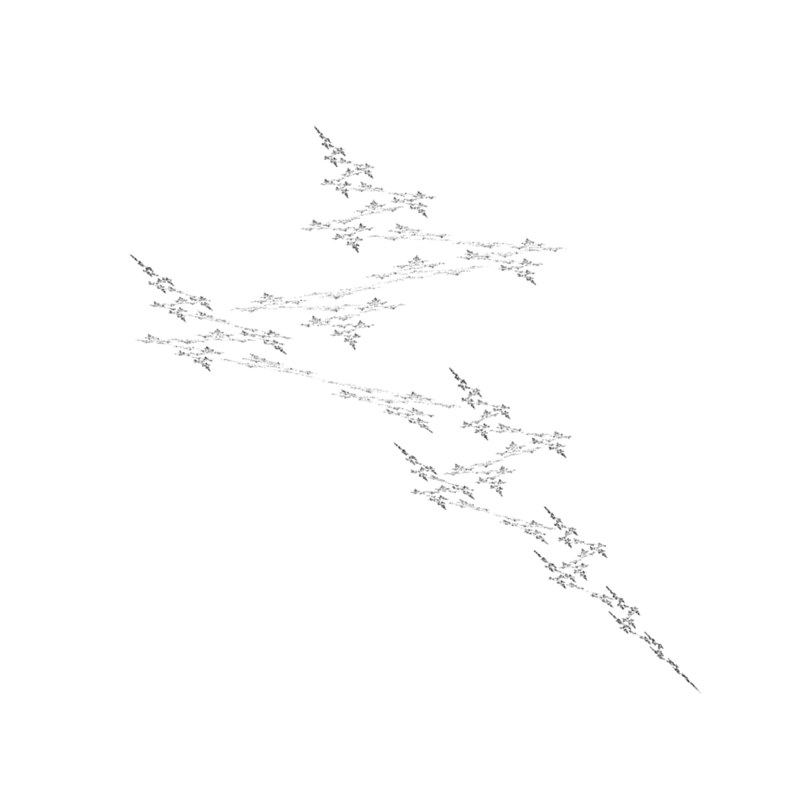
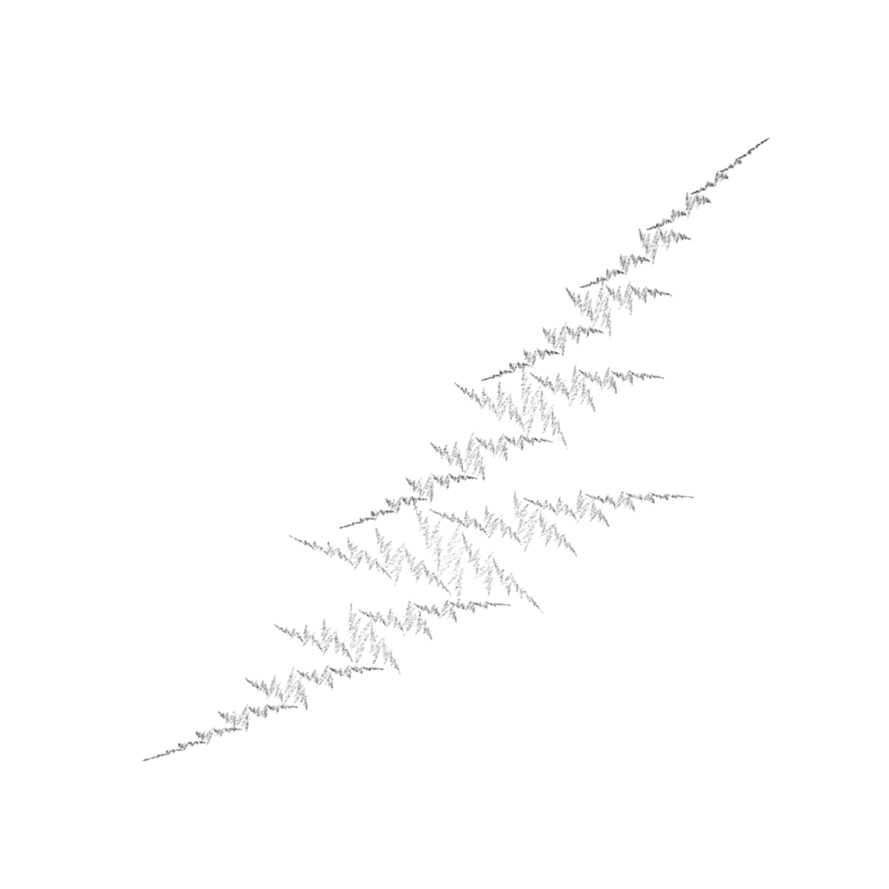
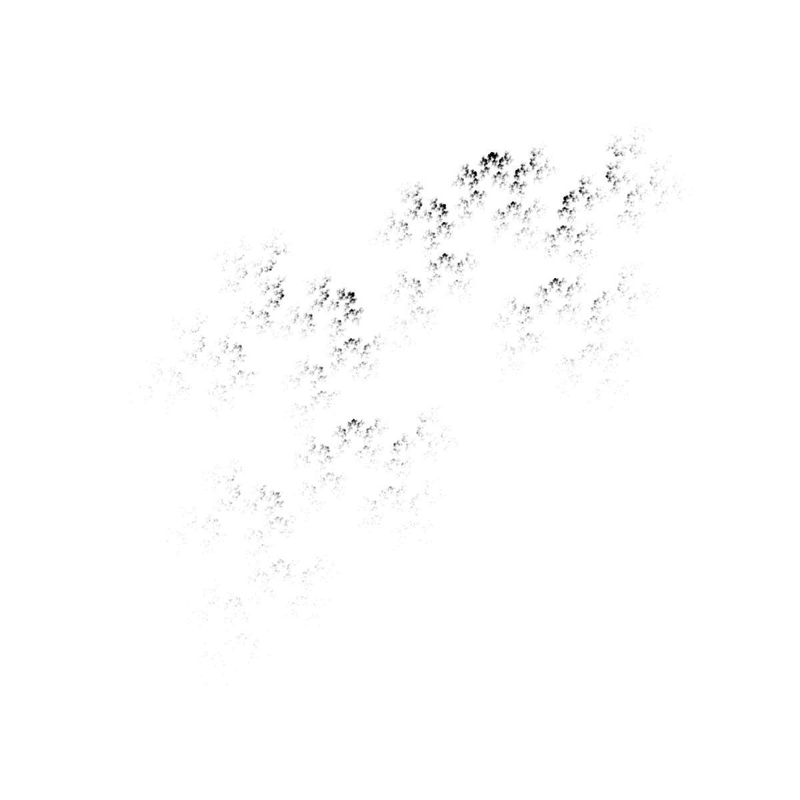

## Introducción  

Los sistemas de funciones iteradas, SFI, son construcciones matemáticas que permiten representar conjuntos de puntos que presentan autosimilaridad, autoafinidad o autocorrelación. En este caso estamos interesados en SFI que apliquen trasformaciones afijas, así estas SFI tomaran la forma:
\begin{gather}
f_{1}(x,y)=
\begin{bmatrix}
c_{1} & c_{2} \\
c_{3}& c_{4} 
\end{bmatrix}
\begin{bmatrix}
x \\
y 
\end{bmatrix}
+
\begin{bmatrix}
c_{5} \\
c_{6}
\end{bmatrix}\\
f_{2}(x,y)=
\begin{bmatrix}
c_{7} & c_{8} \\
c_{9}& c_{10} 
\end{bmatrix}
\begin{bmatrix}
x \\
y 
\end{bmatrix}
+
\begin{bmatrix}
c_{11} \\
c_{12}
\end{bmatrix}
\end{gather}

de forma más específica se ha representado un SFI con dos atractores. Para la representación de el atractor codificado en este SFI se hace uso del algoritmo de iteración aleatoria. Primero se escoge un punto aleatorio del espacio métrico, en este caso de dos dimensiones, seleccionado el punto se escoge una de las funciones que pertenecen al SFI de forma aleatoria, se aplica esta función al punto inicial. Este mismo procedimiento se repetira sobre el resultado de la primera iteración. Las coordenadas de los puntos en las distintas iteraciones se representan en el espacio métrico obteniendose la representación del atractor codificado en el SFI. 

En este trabajo se hace uso del algoritmo propuesto en (1) para la obtención de motivos visualmente relevantes. Así se generan los coeficientes del SFI de forma aleatoria, se obtiene la representación por el metodo de iteración aleatoria mientras se va evaluando la calidad visual de estos mediante dos coeficientes, la dimension fractal y el exponente máximo de Lyapunov. Siguiendo con las conclusiones obtenidas en (1) aquellos atractores visualmente relevantes serán los que posean una dimensión fractal mayor que 1 y un exponente máximo de Lyapunov menor que -0.2. Si cumple estos requisitos la representación se cosiderará visualmente relevante, exito, en caso contrario no se considera relevante, fracaso. Las Figuras 1, 2 y 3 muestran tres SFI visualmente relevantes. 

{width=500 height=500}  

{width=500 height=500}  

{width=500 height=500}  


En este trabajo se quiere averiguar si existen diferencias estadísticamente significativas entre la media del valor de la dimensión fractal de los SFI visualmente relevantes en función del número de atractores codificados en el SFI. También se quiere averiguar si la estrategia usada para generar los coeficientes de forma aleatoria, mediante una distribución uniforme discretizada o continua, posee algún efecto sobre las medias de la dimensión fractal. 


## Lectura de los datos

Se cargán y se exploran la estructura del dataset para comprobar que las variables poseen el formato requerido. 

```{r}
data = read.csv("dinamica.csv")
str(data)
data$Atractores <- factor(data$Atractores)
data$Generador <- factor(data$Generador)
str(data)
```
## Análisis de los datos

Puesto que estamos interesados en como cambia la media de la dimensión fractal, variable FD, en función de el tipo de generador de los coeficientes así como del número de atractores que poseean estos SFI debemos de crear un modelo que considere estas como efectos fijos y la interacción de estos: 

```{r}
aov1 <- aov(FD ~ Atractores + Generador + Atractores*Generador, data=data)
summary(aov1)
```  
Como se puede observar, el único efecto fijo que posee influencia estadísticamente signficativa sobre la media de la dimensión fractal es el número de atractores que posee el SFI.  

Para asegurar que este resultado es válido será necesario comprobar las hipótesis de aplicabilidad del modelo.

```{r}
par(mfrow=c(2,2))
plot(aov1)
ks.test(rstudent(aov1), pt, df=nrow(data)-2-2)
```  
Puesto que los datos divergen de la normalidad, vease qq-Plot así como resultado del test de Kolmogorov-Smirnov, se intentará realizar una trasformación de tipo Box-Cox sobre los datos

```{r}
lambda <- EnvStats::boxcox(data$FD, lambda = c(-10,10), optimize = TRUE)$lambda
lambda
data$FD_transformed <- (data$FD^lambda -1)/lambda
aov2 <- aov(FD_transformed ~ Atractores + Generador + Atractores*Generador, data=data)
summary(aov2)
ks.test(rstudent(aov2), pt, df=nrow(data)-2-2)
par(mfrow=c(2,2))
plot(aov2)
```  
Se puede observar como la transformación de Box-Cox de los datos mejora ligeramente la normalidad de los datos si atendemos al qq-plot, sin embargo el test de Kolmogorov-Smirnov sigue descartando la hipótesis núla de normalidad, esto puede deverse al gran tamaño muestral de los datos que hace que se detecte cualquier ligera desviación de la normalidad.  

Si se atiende ahora a la hipótesis de homocedasticidad para el modelo con la variable transformada, esta puede ser evaluada observando el plot Residual Vs Fitted o el de Scale-Location, así como mediante un test de Levene  

```{r}
grupos <- cut(aov2$fitted.values, quantile(aov2$fitted.values, (0:3)/3),
include.lowest = TRUE)
lawstat::levene.test(rstandard(aov2), grupos)
```  
La hipótesis de homocedasticidad se descarta en base al test de Levene. De nuevo, este resultado puede ser consecuencia del gran tamaño muestral lo que permite detectar desviaciones mínimas de la homocedasticidad, pues si observamos los plots antes mencionados se puede observar como la dispersión de los datos parece ser homocedástica. 

Por último se realizará un test a posteriori de tipo Tukey para comparar las medias de los grupos entre ellos. 

```{r}
aov2.tukey <- TukeyHSD(aov2, which = "Atractores")
aov2.tukey
```
En base a estos resultados, se puede concluir que los SFI que posean cuatro atractores posee un mayor valor medio de dimensión fractal así como que los que poseen dos atractores tendrán el menor valor medio de dimensión fractal entre las configuraciones de SFI ensayadas. 

## Conclusiones

A la luz de los datos podemos concluir:

-No se cumplen las condiciones de aplicabilidad de un análisis de la varianza, aunque la hipótesis de normalidad mejora aplicando una transformación de tipo Box-Cox con $\lambda=-1.56$. El hecho de que descarte la hipótesis de homocedasticidad mediante un test de Levene puede deberse al gran tamaño muestral, puesto que no se aprecia heterocedasticidad en los gráficos de valores predichos frente a residuos.

-El modelo indica que el número de atractores posee una influencia significativa en la media de la variable respueta, mientras que la estrategia por la que se generarón los coeficientes no. 

-Los SFI con cuatro atractores poseen la media más alta mientras que los SFI con 2 atractores posee el menor valor medio en la dimensión fractal de entre las configuraciones escogidas. 

## Bibliografía

1-. Sprott, J. C. (1994). Automatic generation of iterated function systems. Computers & graphics, 18(3), 417-425.


